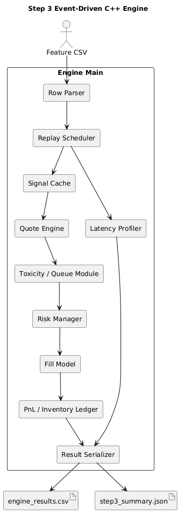
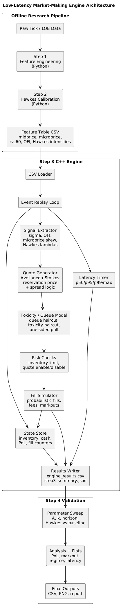
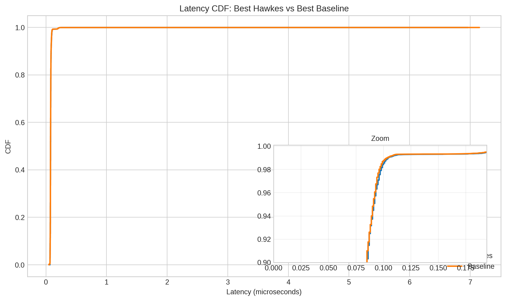
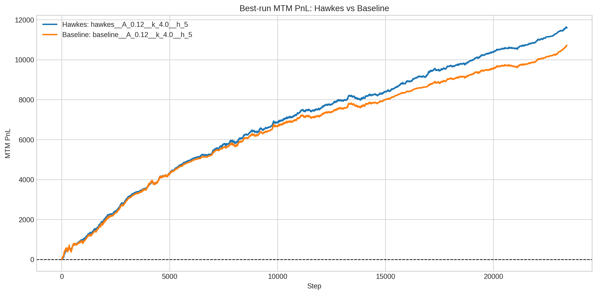
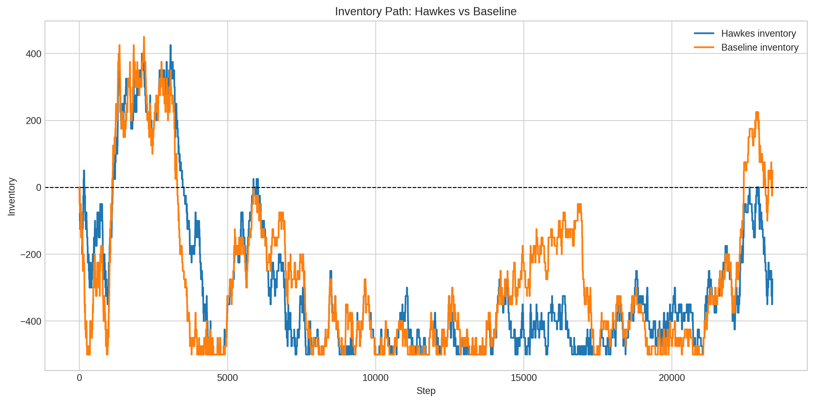
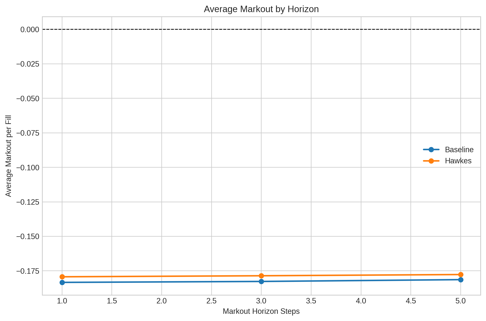
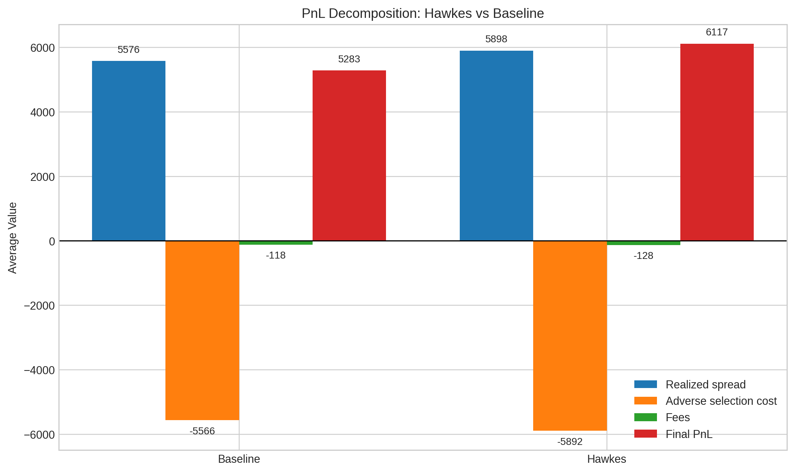
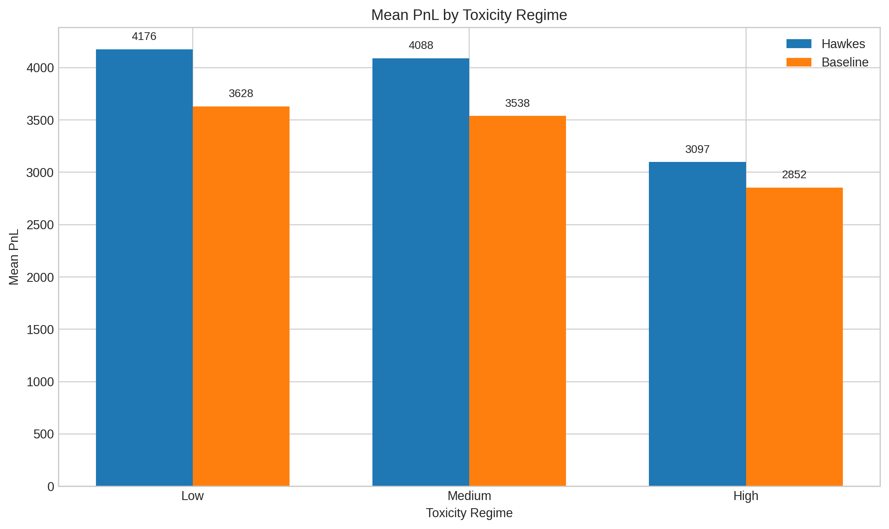
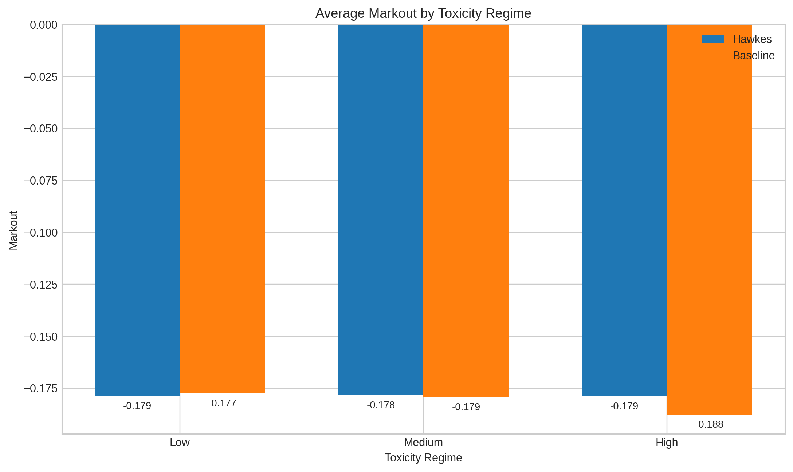
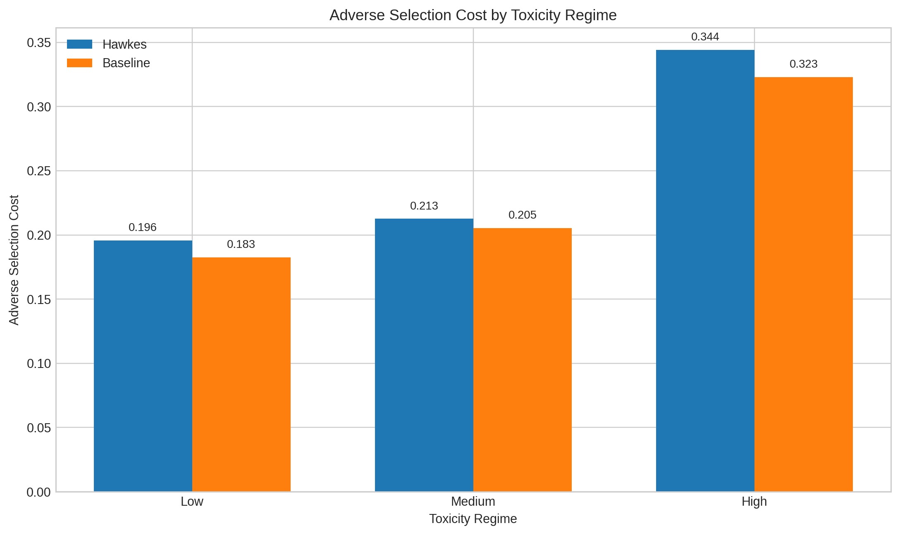

# Low-Latency Market-Making Engine with Hawkes-Driven Order Flow Modeling

## Overview

This project is my attempt to build a market-making system the way I think a serious quant dev project should be built: not as a single notebook with a few attractive backtest plots, but as a full research and engineering pipeline with clear architecture, measurable performance, explicit risk controls, and reproducible outputs.

The pipeline starts with offline feature engineering and Hawkes calibration in Python, then feeds a replayable event-driven C++ engine that simulates quoting, inventory management, fills, PnL evolution, and latency. On top of that, I added a validation layer that compares a Hawkes-informed strategy against a baseline market maker using both aggregate and regime-based analysis.

My goal here was not just to show that I could fit a model or write a fast engine in isolation. It was to show that I can connect market microstructure intuition, quantitative modeling, systems design, benchmarking, and clear communication in one project.

## What I built

I structured the project as a staged pipeline so that each component has a clear responsibility and can be reasoned about independently.

### 1. Feature engineering

I start from raw tick / order-book style data and convert it into a feature table that can be replayed efficiently inside the engine. The feature set includes:

- midprice,
- microprice,
- realized volatility,
- order flow imbalance,
- and Hawkes intensity features.

This step matters because it turns raw market events into a compact, stateful representation that the quoting logic can consume at low overhead during replay.

### 2. Hawkes calibration

I calibrate a Hawkes process offline to model self-excitation in order flow. The reason I wanted Hawkes here is that order arrivals in real markets are not independent; they cluster. Instead of reacting only to the current state of the book, the strategy can also react to the recent intensity and persistence of market activity.

That makes the signal layer more realistic for short-horizon market making, where the timing and clustering of order flow often matter just as much as the snapshot state.

### 3. Event-driven C++ engine

The core of the project is a replayable event-driven engine written in C++. This engine is responsible for:

- loading and parsing the feature stream,
- replaying events step by step,
- extracting signals needed for quoting,
- generating quotes,
- adjusting behavior based on toxicity and queue assumptions,
- applying inventory and risk checks,
- simulating fills,
- updating inventory, cash, and PnL,
- profiling latency,
- and serializing outputs.

This is the part of the project I care about most, because it is where the modeling and systems work meet. I did not want the strategy logic buried in a pandas loop where state transitions, execution assumptions, and performance are hard to inspect. I wanted a clean engine with explicit control flow and measurable runtime behavior.

### 4. Validation and analysis

Once the engine produces run outputs, I evaluate the Hawkes strategy against a baseline across parameter settings and markout horizons, then summarize the results through plots, decomposition views, and regime analysis.

That separation between engine execution and downstream analysis was intentional. It keeps the project easier to test, easier to benchmark, and easier to extend.

## Architecture

One thing I wanted this project to communicate clearly is architectural discipline. The workflow is split into an offline research pipeline and an online-style simulation engine.

The offline side handles feature engineering and Hawkes calibration. The online-style side handles event replay, signal extraction, quote generation, risk management, fill simulation, state updates, profiling, and result writing.

Within the Step 3 engine itself, the modules are intentionally separated rather than collapsed into one monolithic block.

That design choice matters for a few reasons:

- it makes the flow of state explicit,
- it makes the engine easier to benchmark and profile,
- it makes debugging simpler,
- and it makes the project much easier to explain in an interview.

If I were discussing this with a trading systems team, I would want them to see that I think in terms of interfaces, state ownership, and execution flow rather than just strategy formulas.

## Strategy design

At the strategy level, the engine uses Avellaneda-Stoikov style reservation-price and spread logic as the base quoting framework, then layers in microstructure-aware adjustments.

The quote generation uses inputs such as:

- order flow imbalance,
- microprice skew,
- Hawkes-derived order flow intensity,
- inventory state,
- and a set of execution frictions.

On top of that, I modeled:

- queue haircut effects,
- toxicity haircuts,
- one-sided pull behavior in toxic conditions,
- maker fees,
- markouts,
- inventory limits,
- and latency-budget monitoring.

I think this makes the project much more realistic than a purely academic backtest. The engine is still a simulator, but it is trying to capture the right sources of edge and the right sources of pain. That distinction matters a lot in market making.

## Benchmarking and systems performance

I benchmarked the engine across 20 measured runs after warmup. The purpose of the benchmark was not just to produce a single average timing number, but to characterize repeatability, throughput, memory footprint, latency distribution, and worst-case behavior.

| Metric | Value |
|---|---:|
| Measured runs | 20 |
| Mean wall time | 221.887 ms |
| Median wall time | 221.795 ms |
| p95 wall time | 224.271 ms |
| p99 wall time | 224.680 ms |
| Mean throughput | 105,464.13 events/sec |
| Median throughput | 105,502.72 events/sec |
| p05 throughput | 104,338.30 events/sec |
| p95 throughput | 106,655.67 events/sec |
| Mean peak RSS | 16,758.8 KB |
| Max peak RSS | 17,048.0 KB |
| Median engine p50 latency | 0.076 us |
| Median engine p95 latency | 0.090 us |
| Median engine p99 latency | 0.102 us |
| Worst observed max latency | 9.308 us |
| Latency budget exceedances | 0 |

A few things stand out to me here.

First, the engine is not just fast on one run; it is stable across repeated runs. The difference between median and tail wall time is small, throughput is tightly clustered, and memory usage stays modest.

Second, the latency profile is strong. The median p50, p95, and p99 engine latencies are all well below a microsecond, and even the worst observed maximum latency remains far inside the 500-microsecond budget used in the experiment.

Third, zero latency-budget breaches across all measured runs is exactly the kind of result I wanted from the instrumentation. It shows that the engine is not only performant on average, but also operating comfortably within the defined constraints.

I consider the latency CDF an important part of the story because it shows the whole distribution rather than only reporting summary statistics. The zoomed view is especially useful because the main body of the distribution is tightly packed; without the zoom, the shape would be harder to interpret.

## Best-run comparison

The cleanest top-level comparison in the project is the best Hawkes run versus the best baseline run.

| Metric | Hawkes | Baseline |
|---|---:|---:|
| Best run ID | hawkes__A_0.12__k_4.0__h_5 | baseline__A_0.12__k_4.0__h_5 |
| Final MTM PnL | 11,592.47 | 10,723.18 |
| Risk-adjusted score | 11,450.01 | 10,527.80 |

Both best runs occurred at the same parameter setting: \(A = 0.12\), \(k = 4.0\), and markout horizon \(h = 5\). I like this result because it makes the comparison cleaner. The improvement is not coming from comparing very different operating points; the Hawkes-informed strategy wins under the same best parameter tuple.

That is exactly the kind of result I wanted to see. It suggests the model-driven signal is adding value at the strategy level rather than just shifting the search toward a luckier parameter region.

The PnL path is also important. Hawkes does not win because of a single outlier jump late in the run. Instead, the advantage builds gradually over time. To me, that is a much more believable pattern for microstructure-driven edge.

## Inventory behavior

Inventory control is one of the first things I look for when I read a market-making project, because it is where many otherwise promising backtests stop being realistic.

In this engine, inventory is active and meaningful. It moves materially, often approaches the configured limits, and still remains bounded.

That tells me two good things about the design.

First, the strategy is actually taking risk and providing liquidity rather than being artificially neutered by overly conservative controls. Second, the risk layer is still doing real work, because inventory never runs away uncontrollably.

In other words, the engine is allowing the strategy to express views while still respecting a clear risk envelope.

## Markout analysis

I included markout analysis because I do not think market-making evaluation is complete without it. PnL alone is not enough; I also want to know whether fills still look good a few steps later or whether the strategy is mainly getting picked off.

The average markout remains negative across horizons for both strategies. I actually see that as a positive sign for the credibility of the simulator, because it reflects the reality of adverse selection rather than painting an artificially clean picture.

More importantly, the Hawkes strategy is consistently a bit less negative than the baseline across the tested horizons. The improvement is incremental rather than dramatic, which again makes the result more believable.

## PnL decomposition

This is one of my favorite plots in the project, because it explains *why* the Hawkes strategy wins.

The picture is nuanced:

- Hawkes captures more realized spread: about 5,898 versus 5,576.
- Hawkes pays slightly more fees: about 128 versus 118.
- Hawkes also incurs somewhat more adverse selection cost in absolute terms: about 5,892 versus 5,566.
- Even so, Hawkes still ends with higher final average PnL: about 6,117 versus 5,283.

The takeaway is not that Hawkes magically avoids toxic flow. It does not. Instead, it seems to participate in a more productive way: it captures enough extra spread to more than compensate for the additional costs.

To me, that is a much stronger result than one where a model wins simply by becoming overly passive and refusing to trade.

## Toxicity-regime analysis

I wanted to know whether the Hawkes edge only appears in easy conditions or whether it persists across different market environments. That is why I broke the evaluation down by toxicity regime.

### Mean PnL by regime

The Hawkes strategy leads in all three regimes:

- Low toxicity: 4,176 versus 3,628
- Medium toxicity: 4,088 versus 3,538
- High toxicity: 3,097 versus 2,852

This matters because it shows the advantage is not confined to calm conditions. Absolute PnL drops for both strategies as the environment becomes harsher, which is exactly what I would expect, but Hawkes still preserves a lead.

### Markout by regime

Average markout is negative in every regime, but Hawkes is modestly better in the more difficult settings. In high toxicity, Hawkes is about -0.179 while the baseline is about -0.188.

That is not a giant numerical gap, but in the context of passive execution quality it is directionally meaningful.

### Adverse selection by regime

Adverse selection cost rises sharply as toxicity increases for both strategies:

- Hawkes: 0.196, 0.213, 0.344 from low to high toxicity
- Baseline: 0.183, 0.205, 0.323 from low to high toxicity

This is exactly the type of behavior I wanted to see from the simulator. High-toxicity periods should be more expensive for a passive market maker, and the plots reflect that clearly.

What I find especially interesting is that Hawkes still maintains a PnL edge despite slightly higher adverse selection cost. That reinforces the interpretation from the decomposition plot: the strategy is not winning by sidestepping difficult flow, but by extracting more value when it does participate.

## Why I think the results are credible

The easiest way to make a trading project look impressive is to remove most of the real-world friction. I tried not to do that here.

A few features make the results feel believable to me:

- markouts are negative rather than unrealistically positive,
- adverse selection worsens in more toxic regimes,
- inventory moves materially instead of staying pinned near zero,
- fees are explicitly included,
- latency has a real tail even though the engine is fast,
- and the Hawkes edge is meaningful but not absurdly large.

That combination is important. The outputs look like the result of a simulator with real trade-offs rather than a presentation tuned only to maximize headline PnL.

## What this project demonstrates

I think the project demonstrates three distinct kinds of ability.

### Quantitative thinking

- framing market making as a microstructure problem rather than a pure forecasting problem,
- using Hawkes intensities as part of execution logic rather than as a standalone academic exercise,
- evaluating performance through PnL, markout, adverse selection, and regime behavior,
- and interpreting small but persistent improvements instead of only chasing dramatic backtest gains.

### Systems thinking

- building a dedicated C++ event-driven engine,
- separating offline calibration from replay-time execution,
- instrumenting throughput, latency, and memory,
- structuring the engine into modules with clear responsibilities,
- and generating machine-readable outputs for downstream analysis.

### Research maturity

- comparing against a baseline,
- running parameter sweeps instead of showcasing only one cherry-picked run,
- using plots that explain mechanisms instead of only presenting final scores,
- and being explicit about scope and limitations.

## Questions this project should invite

A good project should lead naturally to deeper technical questions. If I were discussing this in an interview, these are the kinds of questions I would expect and welcome:

- Why does Hawkes improve final PnL even though adverse selection cost is slightly higher?
- What assumptions does the fill simulator make, and how sensitive are results to queue haircut choices?
- Why do the best Hawkes and baseline runs share the same parameter tuple?
- What would change if the engine consumed a binary replay format instead of CSV?
- Where does the 9.308-microsecond max latency come from?
- How would tighter inventory penalties affect spread capture and final PnL?
- How robust are the results to different toxicity thresholds and markout horizons?

To me, that is a sign of a good portfolio project: it creates room for serious discussion instead of ending at surface-level metrics.

## Limitations and honest scope

I also want to be clear about what this project is and is not.

It is not a production exchange gateway or a live HFT deployment stack. It is an offline replay-based simulator with a research-grade architecture, a low-latency event-driven core, explicit execution frictions, and meaningful evaluation.

I think that is the right scope for this kind of project. The point is not to claim production readiness where it does not exist. The point is to demonstrate that I understand how to design, build, measure, and analyze a serious trading system prototype.

## What I would improve next

If I continued expanding the project, the next steps I would prioritize are:

- microbenchmarks for individual engine modules,
- deeper sensitivity analysis on fill-model assumptions,
- more explicit documentation of memory layout and allocation choices in C++,
- deterministic regression tests for engine outputs,
- evaluation on additional instruments or market conditions,
- and a binary replay format instead of CSV input.

These would improve an already solid foundation rather than fixing something fundamentally missing.

## Final take

This project represents the kind of work I want to do as a quant developer: combining modeling, market intuition, low-latency systems design, benchmarking, and careful evaluation in one coherent pipeline.

What I think makes it strong is not just that the Hawkes strategy beats the baseline. It is that the improvement is supported by architecture, profiling, decomposition, regime analysis, and realistic frictions. The project is designed to be inspectable, discussable, and extensible.

If someone reads this report and then wants to talk about market microstructure, replay engines, latency instrumentation, adverse selection, inventory risk, or how to turn research code into a proper systems project, then it has done exactly what I wanted it to do.
